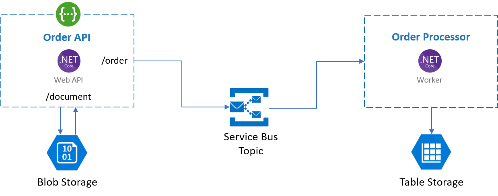

# Order App

This is a demo application that consists of two services, which can be containerized.

> Due to time constraints, the codebase is sometimes quick and dirty.  The focus is not on the code itself, but on a working sample to play around with various Azure PaaS services.

## Order API

This ASP.NET Core Web API uses the Open API Specification.  Three operations are available:
* **POST /order**: sends the order to an Azure Service Bus topic
* **POST /document**: saves the HTTP payload to Azure Blob Storage and returns an Id
* **GET /document/{id}**: returns the document from Azure Blob Storage

:package: The container image is publically available at ghcr.io/your-azure-coach/yac-order-api:latest

:warning: These **mandatory** environment variables are required to run:

|Variable|Description|
|---|---|
|SERVICEBUS_CONNECTIONSTRING|Connection string to Service Bus that includes a SAS with these access rights: *Send* (*) |
|BLOB_CONNECTIONSTRING|Connection string to Storage Account that includes an access key (**)|

> (*) When Managed Identity is enabled (see below), the SAS can be removed from the connection string

> (**) When Managed Identity is enabled (see below), the access key can be removed from the connection string

:bulb: These **optional** environment variables can change the behavior:

|Variable|Description|Default value|
|---|---|---|
|ORDER_RESPONSE_MESSAGE|Response message when order is created|"Thank you for your order!"
|ORDER_MAX_PROCESSING_DELAY|Maximum simulated order processing delay in seconds|0|
|DOCUMENT_RESPONSE_MESSAGE|Response message when document is created|"Thank you for your document!"|
|DOCUMENT_MAX_PROCESSING_DELAY|Maximum simulated document processing delay in seconds|0|
|SERVICEBUS_TOPIC_NAME|Name of the Service Bus topic|orders|
|SERVICEBUS_AUTHENTICATION_TYPE|Set to CONNECTION_STRING if you want to use the plain connection string.  Set to SYSTEM_ASSIGNED_MANAGED_IDENTITY to leverage Managed Identity. (*)|CONNECTION_STRING|
|BLOB_CONTAINER_NAME|Name of the Blob Storage container|documents|
|BLOB_AUTHENTICATION_TYPE|Set to CONNECTION_STRING if you want to use the plain connection string.  Set to SYSTEM_ASSIGNED_MANAGED_IDENTITY to leverage Managed Identity. (**)|CONNECTION_STRING|

> (*) The Managed Identity requires the *Azure Service Bus Data Owner* role (to create the topic and send messages)

> (**) The Managed Identity requires the *Storage Account Contributor* role (to create the container) and the *Storage Blob Data Contributor* role (to read/write documents)

## Order Processor

This ASP.NET Core Worker Services reads orders from the queue and upserts them into Azure Table Storage

:package: The container image is publically available at ghcr.io/your-azure-coach/yac-order-processor:latest

:warning: These **mandatory** environment variables are required to run:

|Variable|Description|
|---|---|
|SERVICEBUS_CONNECTIONSTRING|Connection string to Service Bus that includes a SAS with these access rights: *Listen* (*) |
|TABLE_CONNECTIONSTRING|Connection string to Storage Account that includes an access key|

> (*) When Managed Identity is enabled (see below), the SAS can be removed from the connection string

:bulb: These **optional** environment variables can change the behavior:

|Variable|Description|Default value|
|---|---|---|
|ORDER_MAX_PROCESSING_DELAY|Maximum simulated order processing delay in seconds|0|
|SERVICEBUS_TOPIC_NAME|Name of the Service Bus topic|orders|
|SERVICEBUS_SUBSCRIPTION_NAME|Name of the Service Bus topic|order-processor|
|SERVICEBUS_AUTHENTICATION_TYPE|Set to CONNECTION_STRING if you want to use the plain connection string.  Set to SYSTEM_ASSIGNED_MANAGED_IDENTITY to leverage Managed Identity. (*)|CONNECTION_STRING|
|TABLE_NAME|Name of the Table Storage table|orders|

> (*) The Managed Identity requires the *Azure Service Bus Data Owner* role (to create the topic and send messages)